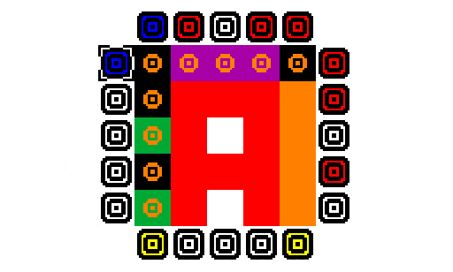

# Shadowcast

### Color blending

### Eternal Work In Progress

A proof of concept of a color puzzle based on the [RYB susbtraction color model](https://en.wikipedia.org/wiki/RYB_color_model).

Based on games like minesweeper and picross, the objective is to blend the markers in the board by swapping and combining the colors of the light bulbs around them (which is physically wrong, as the RYB model is a substraction one not an additive one, but whatever).

Move the cursor with arrow keys. Change the color using the `Z` key.